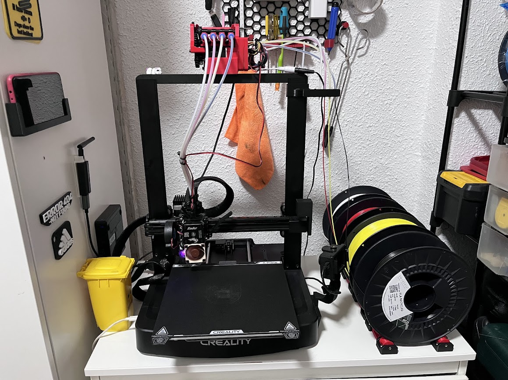
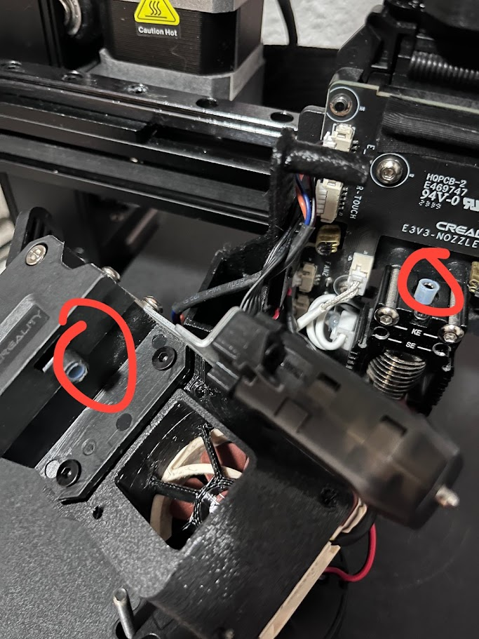

# Guía instalación multicolor

El propósito de este documento es explicar el proceso completo de instalación de Klipper y Pico MMU en nuestra Ender 3 V3 SE para poder imprimir modelos de varios colores. Es necesario que cualquier persona pueda entenderlo correctamente así que si veis algo que se puede corregir o explicar mejor no dudéis en comentarlo o incluso proponer los cambios. Se trata de un documento colaborativo a través del cual todos podamos aprender.

Este mismo proceso es válido para la Ender 3 V3 KE.

> **Ver también:** [README principal](README.md) para detalles generales de configuración y servicios.



## ¿Qué modificaciones necesito realizar?

1. [Klipper](https://www.klipper3d.org/)
2. [Cortador de filamento](https://www.printables.com/model/1243521-filament-cutter-for-ender-3-v3-se)
3. [Hub 4 líneas de filamento](https://www.printables.com/model/1243385-pico-mmu-toolhead-filament-hub-for-ender-3-v3-se-4)
4. [Pico MMU](https://github.com/lhndo/LH-Stinger/wiki/Pico-MMU)
5. [Soporte Pico](https://www.printables.com/model/1222596-pico-mmu-holder-for-ender-3-v3-ke)

## Klipper

Para instalar Klipper y el entorno en nuestra impresora usando este repositorio, sigue estos pasos:

1. Clona el repositorio y entra en la carpeta:
    ```sh
    git clone https://github.com/destaben/klipper_ender3_v3_se.git
    cd klipper_ender3_v3_se
    ```

2. Lanza la instalación automatizada (instala Docker, clona dependencias e inicia los servicios):
    ```sh
    sudo bash setup_services.sh
    ```

3. Para compilar el firmware, ejecuta el script:
    ```sh
    sudo bash build_firmware.sh
    ```
   Esto generará el archivo `klipper.bin` en la carpeta indicada al finalizar el script.

4. Copia el archivo `klipper.bin` a una tarjeta SD y flashea la impresora (con la impresora apagada, inserta la SD y enciende). El nombre del archivo debe terminar en `.bin` y no puede ser el mismo que el último firmware flasheado.

5. Accede a la interfaz web en `http://<IP_DEL_MINI_PC>` para controlar la impresora.

Alternativamente, puedes usar [KIAUH](https://pblvsky.gitbook.io/ender3v3se/remote-control/klipper) siguiendo el tutorial enlazado.

## Cortador de filamento

Es una de las partes más cruciales del multicolor, para que Pico MMU funcione correctamente el cortador tiene que estar entre el hotend y el extrusor. Para ello disponemos de [este modelo](https://www.printables.com/model/1243521-filament-cutter-for-ender-3-v3-se), dejad un like al creador.

Es necesario que no exista rozamiento excesivo entre las piezas, recomiendo seguir las instrucciones al pie de la letra. Es muy importante lijar las piezas y aplicar lubricante a las partes móviles.

El cortador va colocado a presión entre el extrusor y el bloque del hotend, no es necesario atornillarlo aunque es posible. Este viene también con un tope que hay que instalar para que se produzca el corte.
Para un mejor funcionamiento aconsejo poner un trocito de tubo PTFE tanto en el extrusor como en el propio hotend para facilitar la transición.

Una vez instalado, es necesario comprobar que el corte se realiza correctamente ejerciendo presión con la mano. El movimiento en ambos sentidos debe de ser suave y sin excesivo juego hacia los lados.



Será necesario reubicar el ventilador en el lado izquierdo. Existen muchos modelos disponibles.

## Hub 4 líneas

Es otra parte muy importante de nuestro setup, recomiendo imprimirlo en 0,16 de altura o incluso menos. Las paredes y agujeros tienen que quedar lo más perfectos posibles así que probablemente será necesario lijar o taladrar un poco los agujeros para los tubos. Reducir la velocidad de impresión también suele ayudar.

En mi caso también los he asegurado un poco de silicona caliente para evitar que los tubos se salgan por la presión.

## Pico MMU

Y por último tenemos el corazón del cambio de color. En este caso no voy a entrar en mucho detalle ya que todo está perfectamente explicado en la [wiki de Pico MMU](https://github.com/lhndo/LH-Stinger/wiki/Pico-MMU).

Es importante seguir la documentación, cada punto es importante y tiene que ser leído. Revisad la lista de materiales primero para pedir lo que necesitéis. El resto de puntos están explicados ahí, tanto montaje como configuración o pequeños ajustes.

Cualquier duda podéis consultar conmigo o a través del [Discord oficial](https://discord.gg/G8bEaK5F) del creador.

## Soporte Pico

Es un soporte para Pico MMU. Imprime [este modelo](https://www.printables.com/model/1222596-pico-mmu-holder-for-ender-3-v3-ke) y sujétalo a la máquina mediante un tornillo.